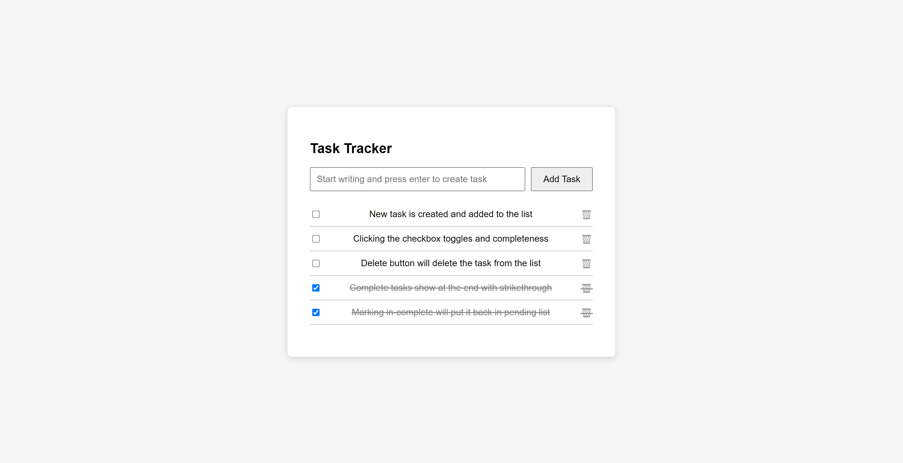

# Task Tracker

## Description

Task Tracker is a simple, intuitive to-do list application that allows users to manage tasks efficiently. You can add tasks, mark them as complete, and delete them as necessary. The application dynamically updates the task list without reloading the page, providing a seamless user experience.

This project is ideal for beginners to understand the basics of DOM manipulation using vanilla JavaScript and CSS styling. It serves as an excellent starting point for building more advanced task management applications.

Explore the project via the [live demo here](https://codepen.io/Yashi-Singh/pen/QWXXeGJ).

### Features:
- **Add Task**: Create new tasks by entering text and pressing the Enter key or clicking the Add Task button.
- **Task Completion**: Toggle between pending and completed tasks by clicking the checkbox next to each task. Completed tasks are shown with a strikethrough.
- **Delete Task**: Remove tasks by clicking the trash can icon next to each task.
- **Dynamic Sorting**: Pending tasks are listed first, followed by completed ones for better task management.

### Alternatives:
This Task Tracker is designed for simplicity and small-scale personal use. For more advanced features, such as multi-user collaboration, notifications, or priority labeling, alternatives like [Todoist](https://todoist.com/) or [Trello](https://trello.com/) might be better suited.

## Visuals



## Installation

To run the project locally:

1. Clone the repository:
   ```bash
   git clone https://github.com/Yashi-Singh-9/Task-Tracker.git
   ```
2. Navigate to the project folder:
   ```bash
   cd Task-Tracker
   ```
3. Open `index.html` in your browser:
   ```bash
   open index.html
   ```
   Alternatively, drag and drop the `index.html` file into a web browser.

### Requirements

- A modern web browser (Chrome, Firefox, Safari, Edge)
- No additional dependencies; the project runs on vanilla HTML, CSS, and JavaScript.

## Usage

Here’s how to use the Task Tracker:

1. **Add a task**:
   - Type a task in the input box (e.g., "Finish homework").
   - Press `Enter` or click the **Add Task** button.
   
   Example:
   ```plaintext
   Task added: Finish homework
   ```

2. **Mark task as complete**:
   - Click the checkbox next to a task to mark it as completed.

   Example:
   ```plaintext
   Task completed: Finish homework (strikethrough added)
   ```

3. **Delete a task**:
   - Click the trash can icon next to a task to delete it.

   Example:
   ```plaintext
   Task deleted: Finish homework
   ```

## Support

If you encounter any issues or have questions, feel free to:

- Open an issue on the repository
- Reach out via [LinkedIn](https://www.linkedin.com/in/yashi-singh-b4143a246)

## Authors and Acknowledgment

- **Yashi Singh** – Developer of the Task Tracker
- Special thanks to the team at [roadmap.sh](https://roadmap.sh/projects/task-tracker-js) for project inspiration.

## License

This project is licensed under the MIT License - see the [LICENSE](LICENSE) file for details.

## Project Status

This project is currently **active**, but feature requests and contributions are welcome. Future improvements could include:
- Task editing functionality
- Persistent task storage using localStorage
- Task categorization and prioritization
